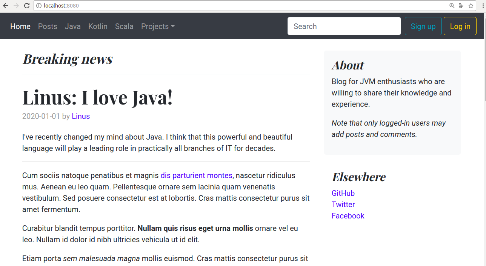

# Blog

Java (Spring/Hibernate) application with MySQL database that allows logged-in users to add posts and comments.
Template code was delivered by [Akademia Kodu](http://www.akademiakodu.pl/). 

My contribution:
- own frontend (Bootstrap)
- ability to add comments to a given post
- displaying posts and comments in specific order
- some little improvements (mainly in controllers, services etc.)

---

   

